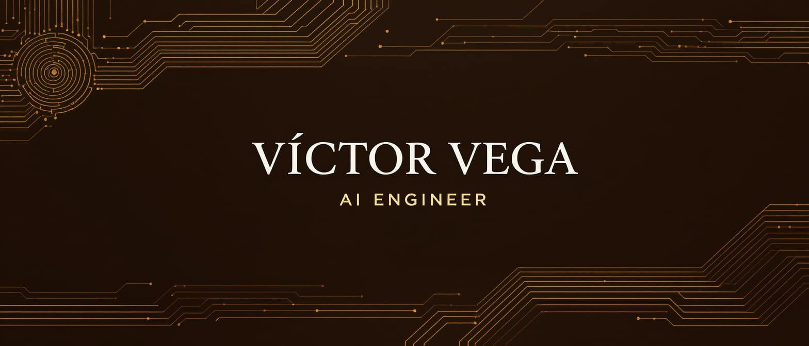
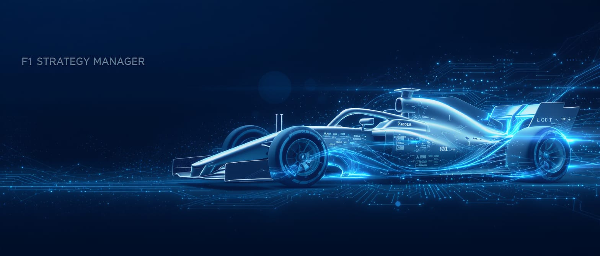

# 🏎️ Welcome to my GitHub Profile!

  

I'm currently a 4th-year student in **Intelligent Systems Engineering** at UIE Campus Coruña, with a strong focus on AI applications in motorsport analytics. I'm also an alumnus of the **Engineering Summer Programme (2023)** at Girton College, Cambridge University, where I gained foundational knowledge in quantum mechanics, jet engines, and nanotechnology.

Continuously expanding my expertise through self-directed learning, I'm currently completing the **Deep Learning Specialization by Andrew Ng** on Coursera, among other certifications and courses in AI and data science, such as **IBM Deep Learning with PyTorch, Keras and Tensorflow Professional Certificate**.

---

## 🌟 About Me

* 🏁  **Dedicated to Formula 1 AI & Data Analytics** : I channel my passion for F1 into projects like  **F1 Strategy Manager** , developing multi-model AI systems that combine machine learning, computer vision, and NLP to optimize race strategies.
  * *Related work* : Authored research on applying rule-based expert systems and predictive modeling to F1 strategy optimization.
* 💡  **Driven by AI-Powered Sports Analytics** : My academic background is heavily focused on machine learning, deep learning, and intelligent systems, with a strong mathematical foundation. I'm passionate about decoding complex F1 phenomena through data analysis, extracting meaningful patterns from telemetry data, weather conditions, and team communications to understand the subtle factors that determine race outcomes.
* 🌱  **Committed to AI Model Optimization** : I specialize in identifying and implementing the most effective AI models for complex, multi-dimensional racing data. From tire degradation patterns to strategic decision points, I enjoy building systems that transform raw data into predictive insights that would be impossible to detect manually.

---

## 🛠️ Technical Skills

* **Languages:**
  * Python (advanced data science stack)
  * JavaScript, HTML, CSS (beginner level from web project experience)
* **Frameworks & Libraries:**
  * **Data Science** : pandas, NumPy, scikit-learn, XGBoost, PyTorch, TensorFlow
  * **Domain-Specific** : FastF1, Experta (rule engine), Digital Twin frameworks
  * **Visualization** : Matplotlib, Seaborn, Plotly, Streamlit, Reflex
  * **ML Ops** : Custom training pipelines, model versioning
* **Specialized Expertise:**
  * Multi-modal AI systems (computer vision, NLP, time-series analysis)
  * Deep learning for complex pattern recognition in racing data
  * Intelligent systems and expert rule engines for strategic decision-making
  * Mathematical modeling of racing dynamics and tire physics
  * Interactive dashboards for real-time race strategy optimization
  * Predictive analytics for performance trends under varying conditions

---

## 📂 Featured Projects

### 🏎️ F1 Strat Manager AI

An integrated F1 Strategy Assistant that combines different AI models to provide recommendations for race engineers. It leverages multiple AI methods—from Deep Learning and NLP to expert systems and predictive modeling—to optimize Formula 1 race strategies.

  

🔗 [github.com/VforVitorio/F1_Strat_Manager](https://github.com/VforVitorio/F1_Strat_Manager)

### 🏁 F1 AI Team Detection

Project focused on identifying and classifying F1 teams from race images and videos.The project also includes a feature that draws a line displaying the gap between cars in both meters and seconds. Extension of the Team Detection modelling made in F1 Strat Manager AI.

  

🔗 [github.com/VforVitorio/F1_AI_team_detection](https://github.com/VforVitorio/F1_AI_team_detection)

### 🌐 Web Development Portfolio

Responsive websites and apps built with HTML, CSS, JavaScript, and Reflex for seamless UX.

🔗 [Digital Transformation Tool](https://github.com/VforVitorio/Transformacion)

[🔗 SailGreen, sustainable ship renting idea](https://vforvitorio.github.io/)

### 🤖 AI & Simulation Experiments

Gymnasium-based simulations exploring reinforcement learning in dynamic environments.

🔗 [github.com/VforVitorio/PLE03](https://github.com/VforVitorio/PLE03)

Final project of Machine Learning subject made alongside @[Santisoutoo](https://github.com/Santisoutoo), first semester of third year.

🔗 [https://github.com/Santisoutoo/aprendizaje_autom-tico](https://github.com/Santisoutoo/aprendizaje_autom-tico)

---

<!-- Banner image goes here -->

## 🌐 Let’s Connect

Feel free to reach out for collaborations, questions, or just to chat about F1 and AI:

- 📧 [victorvegasobral@yahoo.com](mailto:victorvegasobral@yahoo.com)
- 💼 [LinkedIn](https://www.linkedin.com/in/victorvegasobral/)
- ✍️ [Medium profile, where I publish stuff related to AI and Formula 1](https://medium.com/@VforVitorio/)

---

*Thank you for stopping by—check out my repositories below!*
