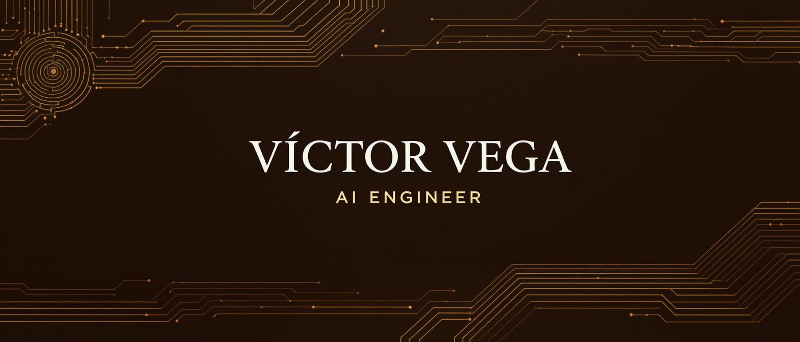

# Víctor Vega Sobral

*4th-year Intelligent Systems Engineering at UIE Coruña · AI & Formula 1 analytics*

  

  
  

  

I work mostly on AI applied to Formula 1: strategy systems, telemetry analysis, computer vision over race footage and a few side experiments outside motorsport. Currently AI & Data intern at NTT Data Spain, focused on agentic AI. Alumnus of the Cambridge Engineering Summer Programme (2023, Girton College).

---

## Featured projects

### F1-StratLab — multi-agent F1 strategy system

  

Final Degree Project. Seven ML models (XGBoost, TCN + MC Dropout, LightGBM, RoBERTa, SetFit, BERT-large, Whisper) plus a LangGraph multi-agent orchestrator and a 2D race replay UI. RAG over FIA regulations on Qdrant.

[github.com/VforVitorio/F1-StratLab](https://github.com/VforVitorio/F1-StratLab) · [Landing](https://vforvitorio.github.io/f1stratlab-web/) · [DeepWiki](https://deepwiki.com/VforVitorio/F1-StratLab)

### F1 AC Digital Twin — Assetto Corsa behavioral RL

Formula 1 digital twin trained with behavioral cloning and reinforcement learning over Assetto Corsa, with a Grafana / InfluxDB / Apache Kafka monitoring stack.

[github.com/VforVitorio/F1_AC_Digital_Twin](https://github.com/VforVitorio/F1_AC_Digital_Twin)

### F1 AI Team Detection — YOLOv12 over race footage

  

Detection and classification of F1 teams from race images and videos, with a derived feature that draws car-to-car gap in metres and seconds.

[github.com/VforVitorio/F1_AI_team_detection](https://github.com/VforVitorio/F1_AI_team_detection)

### F1 Telemetry Manager — multimodal telemetry analysis

  

Streamlit + FastAPI tool for telemetry inspection, multimodal input and automatic reports. Vendored as a git submodule inside F1-StratLab.

[github.com/VforVitorio/F1_Telemetry_Manager](https://github.com/VforVitorio/F1_Telemetry_Manager)

### lmcode — local coding agent CLI on LM Studio

A small CLI coding agent that runs entirely against a local LM Studio server. No cloud, no telemetry. Personal sandbox to explore tool-using agents on consumer hardware.

[github.com/VforVitorio/lmcode](https://github.com/VforVitorio/lmcode)

### variational_quantum_classifier — quantum ML on Rigetti

Variational quantum classifier built with PyQuil over Rigetti's NISQ infrastructure, applied to spiral dataset separation. Side experiment outside motorsport.

[github.com/VforVitorio/variational_quantum_classifier](https://github.com/VforVitorio/variational_quantum_classifier)

---

## Tech I use day to day

Python · PyTorch · TensorFlow · scikit-learn · LangChain · LangGraph · FastAPI · Streamlit · Docker · pandas · NumPy · Plotly · Git

---

## Education and certifications

- Intelligent Systems Engineering — UIE Coruña (4th year)
- Engineering Summer Programme 2023 — Girton College, Cambridge University
- Deep Learning Specialization — DeepLearning.AI
- PyTorch for Deep Learning Professional Certificate — Coursera
- IBM Deep Learning with PyTorch, Keras and TensorFlow — Coursera
- DeepLearning.AI Data Analytics Professional Certificate — Coursera

---

## Contact

[Portfolio](https://www.victorvegasobral.com) · [LinkedIn](https://www.linkedin.com/in/victorvegasobral/) · [Medium](https://medium.com/@VforVitorio/)

  

