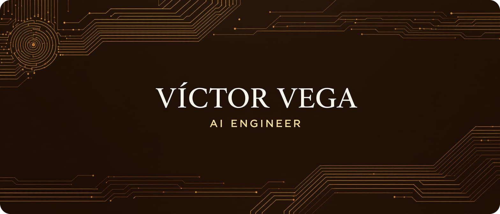
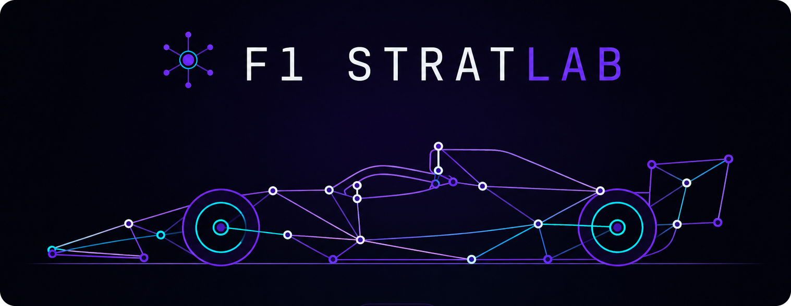
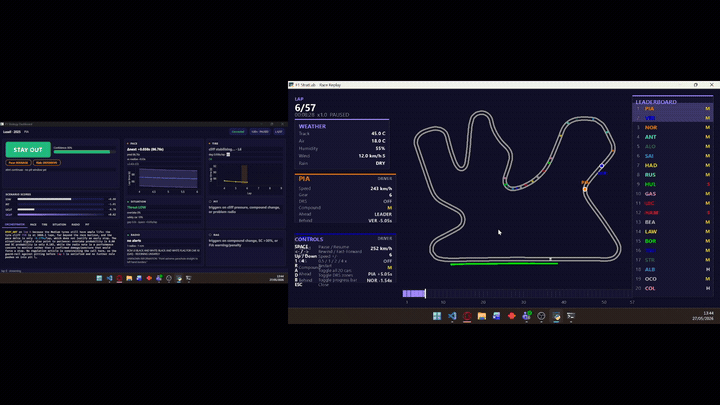
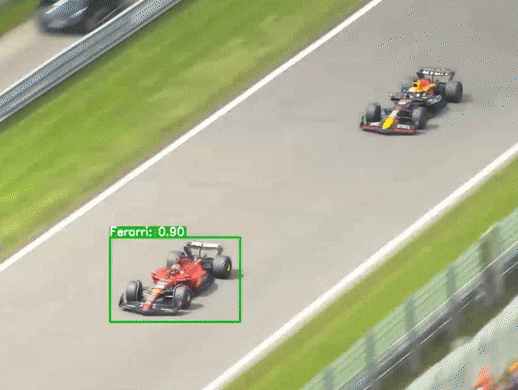
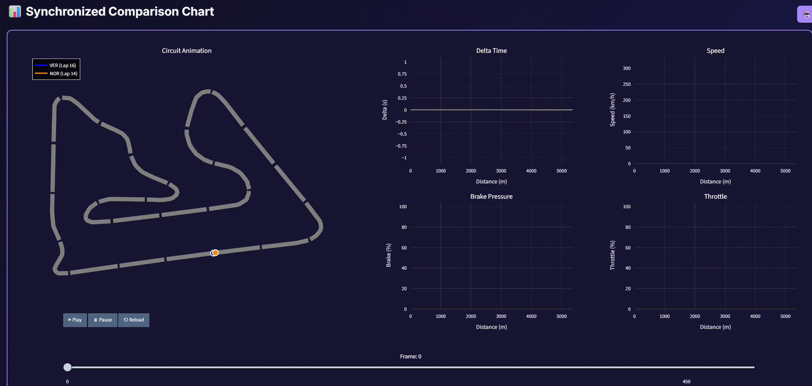
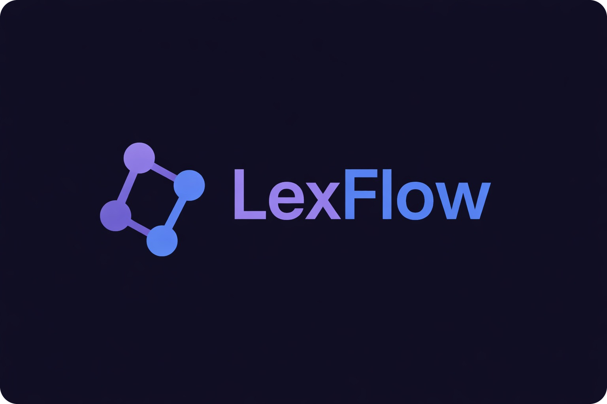

# Hi! I'm Víctor

*Junior AI Engineer at NTT DATA Spain · BSc Intelligent Systems Engineering (UIE) · MSc AI Research (AEPIA/UIMP, alongside full-time) · Formula 1 analytics*

  

  
  

  

  <picture>
    <source media="(prefers-color-scheme: dark)" srcset="https://raw.githubusercontent.com/VforVitorio/VforVitorio/output/github-snake-dark.svg"/>
    <source media="(prefers-color-scheme: light)" srcset="https://raw.githubusercontent.com/VforVitorio/VforVitorio/output/github-snake.svg"/>
    
  </picture>

I work mostly on AI applied to Formula 1: strategy systems, telemetry analysis, computer vision over race footage and a few side experiments outside motorsport. Junior AI Engineer at NTT DATA Spain (A Coruña), working across many areas of AI, from computer vision research to research into LLM behavior, agentic AI solutions and tooling such as Model Context Protocol (MCP) servers. Now pursuing a Master's Degree in Artificial Intelligence Research (AEPIA / UIMP) alongside his full-time role. Alumnus of the Cambridge Engineering Summer Programme (2023, Girton College).

---

## Featured projects

### F1-StratLab — multi-agent F1 strategy system

  
   
  

Final Degree Project. Seven ML models (XGBoost, TCN + MC Dropout, LightGBM, RoBERTa, SetFit, BERT-large, Whisper) plus a LangGraph multi-agent orchestrator and a 2D race replay UI. RAG over FIA regulations on Qdrant.

[github.com/VforVitorio/F1-StratLab](https://github.com/VforVitorio/F1-StratLab) · [Landing](https://vforvitorio.github.io/f1stratlab-web/) · [DeepWiki](https://deepwiki.com/VforVitorio/F1-StratLab)

### F1 AC Digital Twin — Assetto Corsa behavioral RL

Formula 1 digital twin trained with behavioral cloning and reinforcement learning over Assetto Corsa, with a Grafana / InfluxDB / Apache Kafka monitoring stack.

[github.com/VforVitorio/F1_AC_Digital_Twin](https://github.com/VforVitorio/F1_AC_Digital_Twin)

### F1 AI Team Detection — YOLOv12 over race footage

  

Detection and classification of F1 teams from race images and videos, with a derived feature that draws car-to-car gap in metres and seconds.

[github.com/VforVitorio/F1_AI_team_detection](https://github.com/VforVitorio/F1_AI_team_detection)

### F1 Telemetry Manager — multimodal telemetry analysis

  

Streamlit + FastAPI tool for telemetry inspection, multimodal input and automatic reports. Vendored as a git submodule inside F1-StratLab.

[github.com/VforVitorio/F1_Telemetry_Manager](https://github.com/VforVitorio/F1_Telemetry_Manager)

### LexFlow — graph-based AI agent framework

  

Open-source framework for building graph-based AI agent systems on FastAPI and MCP tools. Chat-driven workflows, tool calling and a visual graph interface for debugging and orchestration. Powers my legalize-es legislation corpus.

[github.com/VforVitorio/LexFlow](https://github.com/VforVitorio/LexFlow)

### marginalia — handwritten notes to Obsidian Markdown

  

Turns Kindle Scribe handwritten notebooks into Obsidian Markdown. Import a Scribe PDF, OCR the handwriting (even math, as KaTeX), review it side by side, then export to your vault.

[github.com/VforVitorio/marginalia](https://github.com/VforVitorio/marginalia)

### lmcode — local coding agent CLI on LM Studio

A small CLI coding agent that runs entirely against a local LM Studio server. No cloud, no telemetry. Personal sandbox to explore tool-using agents on consumer hardware.

[github.com/VforVitorio/lmcode](https://github.com/VforVitorio/lmcode)

### variational_quantum_classifier — quantum ML on Rigetti

Variational quantum classifier built with PyQuil over Rigetti's NISQ infrastructure, applied to spiral dataset separation. Side experiment outside motorsport.

[github.com/VforVitorio/variational_quantum_classifier](https://github.com/VforVitorio/variational_quantum_classifier)

---

## Tech I use day to day

  
  
  
  
  
  
  
  
  
  
  
  
  
  
  
  
  

---

## Education and certifications

- Master's Degree in Artificial Intelligence Research — AEPIA / UIMP (in progress)
- Bachelor's in Intelligent Systems Engineering — UIE Coruña · **graduated with a 9.0/10 average and 4 Distinctions (Matrícula de Honor)** · thesis awarded Distinction (Matrícula de Honor) and recommended for conversion into a research paper
- Engineering Summer Programme 2023 — Girton College, Cambridge University
- Deep Learning Specialization — DeepLearning.AI
- PyTorch for Deep Learning Professional Certificate — Coursera
- IBM Deep Learning with PyTorch, Keras and TensorFlow — Coursera
- DeepLearning.AI Data Analytics Professional Certificate — Coursera

---

## Contact

  
  &nbsp;
  
  &nbsp;
  

  

